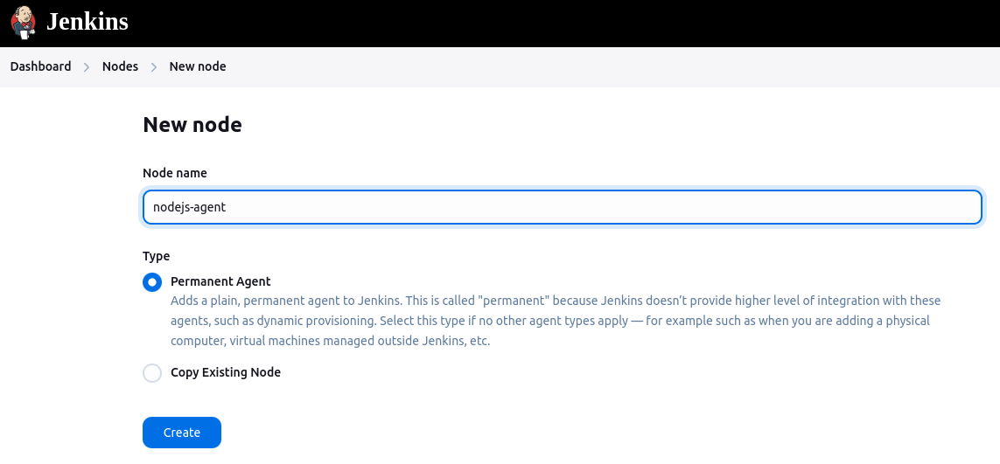

# Jenkins Agent Setup

This repository contains scripts and configuration files for setting up a Jenkins agent using Docker. It includes the necessary steps to build the Jenkins agent image, configure the Docker containers, and integrate the agent with a Jenkins server.

## Prerequisites
Before setting up the Jenkins agent using Docker, ensure the following prerequisites are met:

1. **Docker**:  
   Make sure Docker is installed on your machine. You can install Docker by following the official documentation for your operating system:
    - [Install Docker on Linux](https://docs.docker.com/engine/install/)
    - [Install Docker on macOS](https://docs.docker.com/desktop/install/mac-install/)
    - [Install Docker on Windows](https://docs.docker.com/desktop/install/windows-install/)

2. **Docker Compose**:  
   Docker Compose is required to define and manage multi-container Docker applications. Install Docker Compose by following the official guide:
    - [Install Docker Compose](https://docs.docker.com/compose/install/)

## 1. Package.json Scripts

### Build the Jenkins Agent Image

To build the Jenkins agent image, use the following script:

```bash
  docker build -t jenkins-agent-image:latest .
```

### Start the Docker Containers

To create and start the containers defined in the docker-compose.yml file, use the following script:

```bash
  docker-compose -p jenkins-application -f docker-compose.yaml up -d
```

### Stop the Docker Containers

To stop the containers, use the following script:

```bash
  docker-compose -p jenkins-application -f docker-compose.yaml down
```

## 2. Jenkins Agent Dockerfile

This Dockerfile is used to build a Docker image for a Jenkins agent with Node.js and necessary tools for integration with Jenkins builds. Below is an explanation of the Dockerfile.

### Dockerfile Explanation

```Dockerfile
# Use the official Node.js 18 image as the base
FROM node:18

# Upgrade and install required packages
RUN apt-get update && apt-get -y upgrade && apt-get install -y git openssh-server && apt-get install -y ca-certificates-java openjdk-17-jdk jq

# Install Docker client to interact with Docker daemon
RUN DEBIAN_FRONTEND=noninteractive \
    apt-get install --no-install-recommends --assume-yes \
      docker.io

# Allow GitHub push and pull by adding GitHub's SSH key to the known hosts
RUN ssh-keyscan -t rsa github.com >> /etc/ssh/ssh_known_hosts
RUN chmod 777 /etc/ssh/ssh_known_hosts

# Create a user and group for Jenkins with UID and GID 10000
RUN groupadd -g 10000 jenkins
RUN useradd -m -u 10000 -g 10000 jenkins
RUN echo "jenkins:jenkins" | chpasswd

# Prepare the container for SSH service
RUN mkdir /var/run/sshd

# Expose SSH port for Jenkins agent communication
EXPOSE 22

# Start SSH daemon in the container
CMD ["/usr/sbin/sshd", "-D"]
```

## 3. Docker Compose Configuration

The `docker-compose.yml` file defines the Docker containers and their network configuration.

### Key Features:

- **Volume Mounting `docker.sock`**: The Docker socket is mounted as a volume to allow the Jenkins agent container to interact with the Docker daemon. This enables the container to pull and push Docker images as part of the build process.


- **Custom Network Configuration**: The containers are configured to run on a custom Docker network, which allows them to have static IP addresses. This setup helps with networking between the Jenkins server and agent containers.
```yaml
services:
  jenkins-agent:
    image: jenkins-agent-image:latest
    container_name: jenkins-agent
    ports:
      - "22:22"
    volumes:
      - agent_data:/data
      - /var/run/docker.sock:/var/run/docker.sock
    restart: unless-stopped
    networks:
      jenkins-network:
        ipv4_address: 172.21.0.3

networks:
  jenkins-network:
    ipam:
      config:
        - subnet: 172.21.0.0/16
```

## 4. Configuration of Jenkins Agent on the Jenkins Server

To configure the Jenkins agent on the Jenkins server, follow these steps:

1. **Create the `.ssh` Directory**:  
   On the Jenkins server, create the `.ssh` directory in the Jenkins user's home directory:

    ```bash
    mkdir -p /var/jenkins_home/.ssh
    ```

2. **Add the Jenkins Agent Host to `known_hosts`**:  
   Use the `ssh-keyscan` command to add the IP address of the Jenkins agent container to the `known_hosts` file:

    ```bash
    ssh-keyscan 172.21.0.3 >> /var/jenkins_home/.ssh/known_hosts
    ```

3. **Change Ownership of the `.ssh` Directory**:  
   Ensure that the Jenkins user owns the `.ssh` directory and its contents:

    ```bash
    chown -R jenkins:jenkins /var/jenkins_home/.ssh
    ```

4. **Configure the Agent in Jenkins UI**:  
   To configure the Jenkins agent through the Jenkins UI, follow these steps:


   - **Step 1**: Navigate to Jenkins > Manage Jenkins > Manage Nodes and Clouds > New Node.  
     


   - **Step 2**: Enter the name, description and other config for the agent node.  
     


   - **Step 3**: Choose the "Launch agent via SSH" option and provide the necessary details such as the agent's hostname, credentials, and remote directory.  
     

   This configuration will allow the Jenkins server to securely communicate with the Jenkins agent container using SSH.

## Troubleshooting

If, during your builds, the Jenkins agent interacts with Docker to pull or push images, you may encounter the following error:

```error 
permission denied while trying to connect to the Docker daemon socket at unix:///var/run/docker.sock: 
Post "http://%2Fvar%2Frun%2Fdocker.sock/v1.24/build?buildargs=%7B%22SERVICE%22%3A%22service-demo%22%7D&cachefrom=%5B%5D&cgroupparent=&cpuperiod=0&cpuquota=0&cpusetcpus=&cpusetmems=&cpushares=0&dockerfile=Dockerfile&labels=%7B%7D&memory=0&memswap=0&networkmode=default&rm=1&shmsize=0&t=aymenkoched02%2Fpipeline-demo%3Aservice-demo-23&target=&ulimits=null&version=1": 
dial unix /var/run/docker.sock: connect: permission denied
```

This error occurs when the Jenkins agent doesn't have the required permissions to access Docker. To resolve this issue, follow these steps:

1. Change the group of the `docker.sock` file to `docker`:
   ```bash
   chgrp docker /var/run/docker.sock
   ```

2. Add write permissions for the `docker` group:
   ```bash
   chmod 775 /var/run/docker.sock
   ```

3. Add the `jenkins` user to the `docker` group:
   ```bash
   usermod -aG docker jenkins
   ```
4. After running these commands, restart the Jenkins agent container to apply the changes.

This will help you to fix the permission issues when interacting with Docker inside the Jenkins agent.


